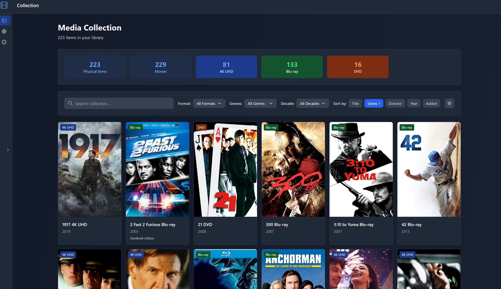
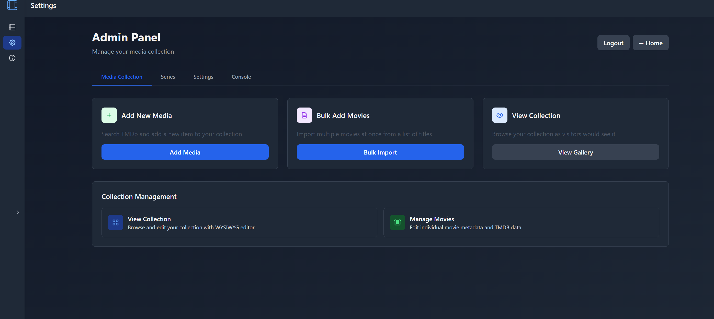
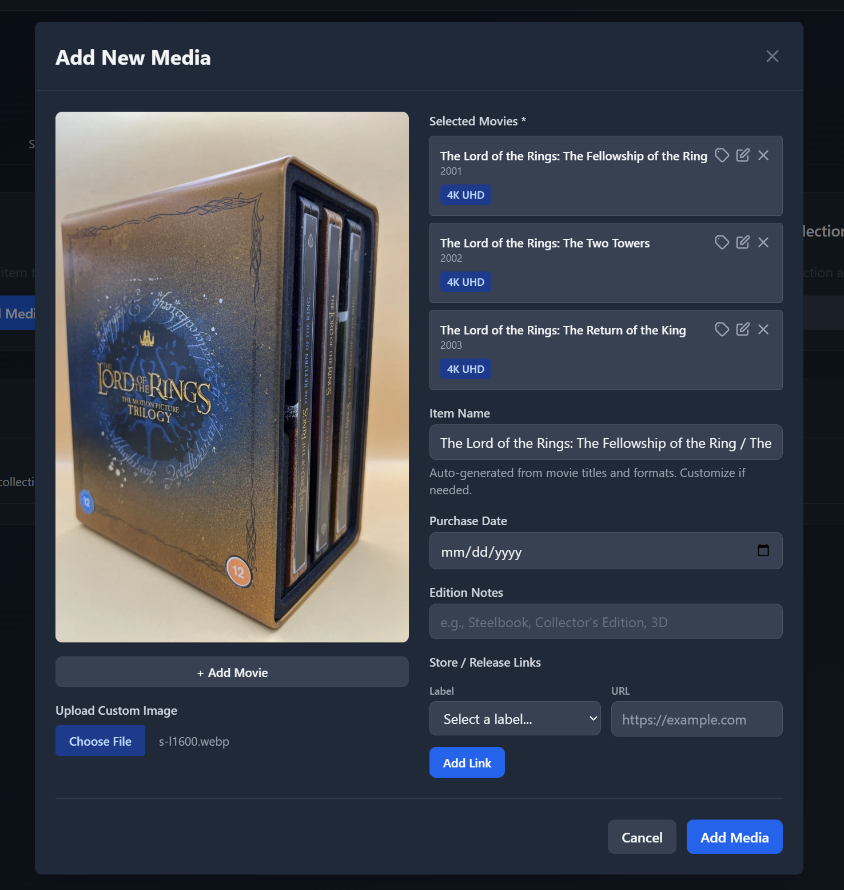

# Cinefile 🎬

A simple, clean, and modern self-hosted web application for cataloging and displaying your personal collection of physical video media (Blu-rays, 4K UHDs, DVDs, LaserDiscs, and VHS). You can see a live read-only version of this at https://cinefile.itsanhonor.me/ (which is my own humble collection!)

## Features

- **Media Management**: Add, edit, and delete entries with TMDb API integration
- **Multiple Formats**: Support for 4K UHD, 3D Blu-ray, Blu-ray, DVD, LaserDisc, and VHS
- **CSV Import/Export**: Backup and restore your collection with full metadata
- **Beautiful Gallery**: Responsive collection view with cover art and filtering
- **Two-Port Architecture**: Read-only public port and full admin port for enhanced security
- **Privacy Control**: Public or private collection visibility
- **Custom Metadata**: Track physical format, edition details, and personal photos

### Gallery View



The main gallery displays your collection with beautiful cover art, filtering by format, and search functionality.

### Admin Panel



Manage your entire collection with the admin interface - add, edit, and delete items with ease.

### Editor Panel



Edit entries with TMDb integration for automatic metadata fetching, or manually enter custom details.

## Data Concepts

Cinefile organizes your physical media collection around these core concepts:

### Physical Items

A **Physical Item** is the actual disc, tape, or other physical media object in your collection. This is what you can hold in your hand. Each physical item can have:
- A unique barcode or identifier
- A physical format (4K UHD, Blu-ray, DVD, LaserDisc, VHS)
- Optional custom photos of the physical media
- Edition details (Criterion, Steelbook, Limited Edition, etc.)
- Other custom metadata fields links to the store page, buying links, etc. 

### Movies

A **Movie** represents the film itself - the artistic work independent of its physical format. Multiple physical items can reference the same movie (for example, you might own both the Blu-ray and 4K UHD of the same film).

### Series

A **Series** represents acollection of related content such as the "Marvel Cinematic Universe" or "Wes Anderson Collefction." Like movies, multiple physical items can reference the same series (complete series collections, etc.).

### Physical Formats

Cinefile supports tracking these physical formats:
- **4K UHD**: Ultra HD Blu-ray discs
- **Blu-ray**: Standard high-definition Blu-ray discs
- **3D Blu-ray**: Blu-ray discs specifically encoded for 3D films
- **DVD**: Standard definition DVDs
- **LaserDisc**: Legacy LaserDisc format
- **VHS**: VHS tapes

Each physical item in your collection is tagged with one of these formats, making it easy to filter and organize by media type.

## Quick Start with Docker

### Prerequisites

- Docker and Docker Compose
- TMDb API key (free at https://www.themoviedb.org/settings/api)

### Setup Steps

1. **Create a `docker-compose.yml` file:**

```yaml
version: '3.8'

services:
  cinefile:
    image: ghcr.io/itsanhonor/cinefile:latest
    container_name: cinefile
    restart: unless-stopped
    # User: Defaults to nodejs (UID 1001) from Dockerfile
    # To override, uncomment and set to your user ID:
    # user: "1000:1000"
    ports:
      # Read-Only Port (Public-facing)
      # Maps host port to container port 3000 (read-only server)
      # Default: 3000, change if needed (e.g., 3006:3000)
      - "3000:3000"
      # Admin Port (Full API - Internal/VPN only)
      # Maps host port to container port 3001 (full API server)
      # WARNING: Do not expose this port to the public internet!
      # Default: 3001, change if needed
      - "3001:3001"
    environment:
      - NODE_ENV=production
      # TMDb API Key - Required for movie search and metadata
      # Get your free API key from: https://www.themoviedb.org/settings/api
      - TMDB_API_KEY=${TMDB_API_KEY}
      # Admin Password - Required for admin panel access
      # Set a secure password for the admin panel
      - ADMIN_PASSWORD=${ADMIN_PASSWORD}
      - DATABASE_PATH=/data/database.sqlite
      - UPLOAD_DIR=/data/uploads
    volumes:
      # CHOOSE YOUR STORAGE HERE!
      # Ensure the host directory is writable by the container user (UID 1001 by default)
      # If needed: sudo chown -R 1001:1001 /opt/cinefile
      - /opt/cinefile:/data
```

2. **Configure your environment:**

Create a `.env` file in the same directory:

```env
TMDB_API_KEY=your_tmdb_api_key_here
ADMIN_PASSWORD=your_secure_password
```

Or replace `${TMDB_API_KEY}` and `${ADMIN_PASSWORD}` directly in the docker-compose.yml file.

3. **Start the container:**

```bash
docker compose up -d
```

4. **Access the application:**
   - Read-only (public): http://localhost:3000
   - Admin (internal): http://localhost:3001

### Two-Port Architecture

Cinefile runs two servers in one container:

- **Read-Only Port** (default 3000): Public-facing server with collection viewing only
- **Admin Port** (default 3001): Full API with all CRUD operations - keep this restricted to VPN/internal network

Both servers share the same database, but the read-only server cannot modify data by design.

## License

MIT
